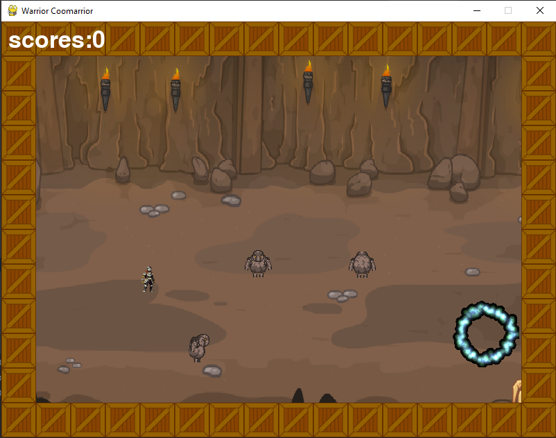
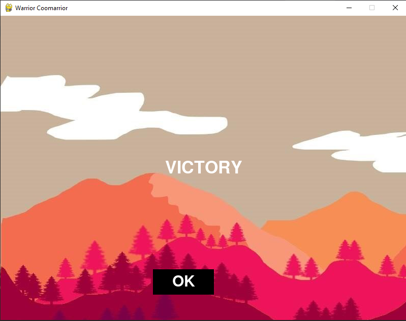

WARRIOR COOMARRIOR
========================

## Оглавление

0. [Запуск](#Запуск)
1. [Управление](#Управление)
2. [Особенности проекта и геймплея](#Особенности-проекта-и-геймплея)
3. [Внешний вид](#Внешний-вид)

## Запуск:

Перед запуском проекта установите необходимые зависимости

```bash
  pip install -r requirements.txt
```

## Управление:

* Управление осуществляется клавишами `W`, `A`, `S`, `D` и `ЛКМ` для
  атаки.
* Запустить игру по новой после смерти нажать на кнопку в появившемся окне

## Особенности проекта

* Проект написан на `pygame2.1.0` с использованием языка `Python 3.9`

* Реализована регулировка громкости из меню.

* уровни созданы вручную, всего три уровня сложности `EASY` `MID` `HARD`

* Во время игры вы увидите монстров, за убийство которых вам дадут определенное количество очков

* игра без восстановления здоровья, контакт с мобом - смерть

* Игрок перед началом игры должен задать свое имя для занесения в таблицу результатов


## Внешний вид

 

[:arrow_up:Оглавление](#Оглавление)
